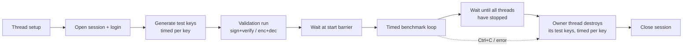
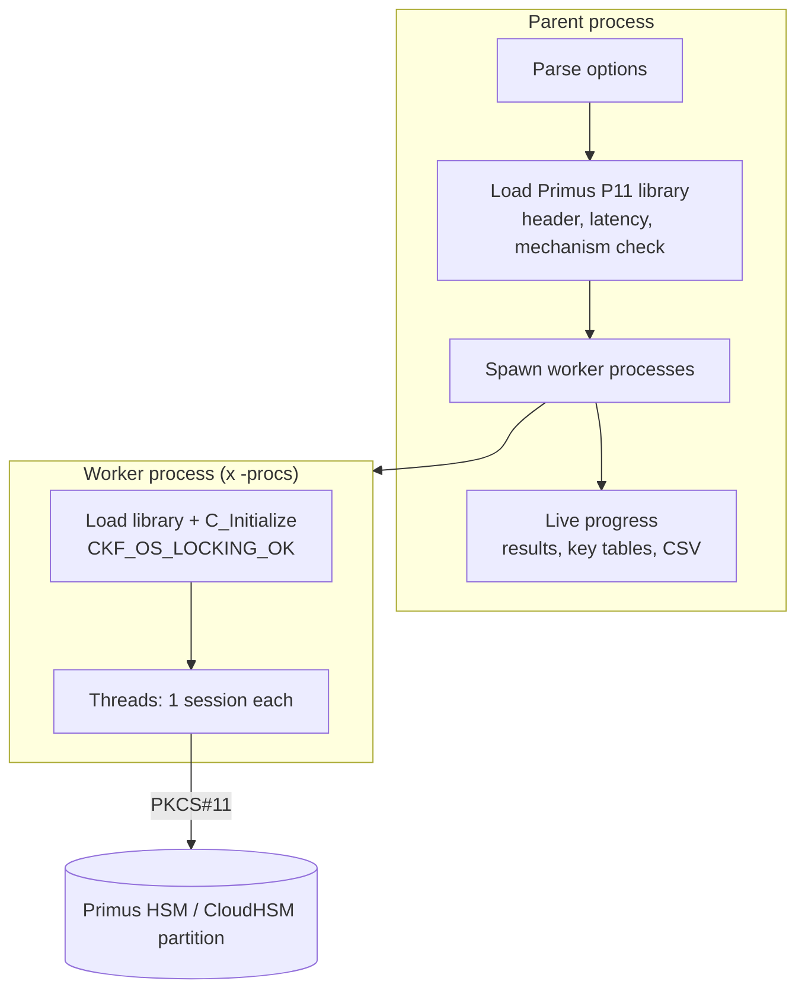

# Primus PKCS#11 Benchmark Utility

`primus_bench` is a multi-threaded performance benchmark for **Securosys Primus HSM** and **Securosys CloudHSM** partitions.
It talks to the HSM through the standard **Primus PKCS#11 Provider** (`primusP11.dll` / `libprimusP11.so`). It measures throughput (operations per second) and latency for classic and post-quantum algorithms.

The utility is a single Python file. It needs no third-party packages and runs on **Windows** and **Linux**.

:::info
`primus_bench` uses only standard PKCS#11 v3.2 functions, mechanisms and attributes as documented in
[PKCS#11 - Specifications](https://docs.securosys.com/pkcs/Concepts/specifications).
It does not use proprietary Securosys vendor extensions, so the results reflect what any standard PKCS#11 application would see.
:::

## Contents

- [Features](#features)
- [Requirements](#requirements)
- [Installation](#installation)
- [Quickstart](#quickstart)
- [Command Syntax](#command-syntax)
- [Option Reference](#option-reference)
- [Test Modes](#test-modes)
- [Test Suites](#test-suites)
- [Algorithm Parameters](#algorithm-parameters)
- [Output Explained](#output-explained)
- [CSV Export](#csv-export)
- [Test Key Lifecycle](#test-key-lifecycle)
- [How Measurements Are Taken](#how-measurements-are-taken)
- [Architecture](#architecture)
- [PKCS#11 Constants and Overrides](#pkcs11-constants-and-overrides)
- [Benchmarking Best Practices](#benchmarking-best-practices)
- [Troubleshooting](#troubleshooting)
- [Security Considerations](#security-considerations)
- [Known Limitations](#known-limitations)
- [Examples](#examples)

---

## Features

| Area | Capability |
| --- | --- |
| Post-quantum | ML-DSA (FIPS 204), SLH-DSA (FIPS 205), ML-KEM (FIPS 203): key generation, sign/verify, encapsulate/decapsulate |
| Classic asymmetric | RSA PKCS#1 v1.5, RSA-PSS, RSA-OAEP, ECDSA, EdDSA (Ed25519/Ed448), ECDH |
| Symmetric | AES ECB/CBC/CBC-PAD/CTR/GCM, AES-CMAC, HMAC (SHA-1/2/3), AES Key Wrap with Padding |
| Other | Key generation benchmarks, digest, random generation, session open/close |
| Scale-out | N threads per slot, multiple slots/partitions, multiple worker processes |
| Key usage | One shared key set per slot used by all threads (default), or one key set per thread (`-perthreadkey`) |
| Visibility | Created-keys table, key creation timing, deletion report, HSM round-trip latency, mechanism support check |
| Reporting | Live ops/s, per-operation ops/s, avg/min/p50/p95/p99 latency, suite comparison table, CSV export |
| Safety | All test keys are labelled `p11bench_*` and deleted after the run (including on Ctrl+C), with a `-cleanup` command for leftovers |

---

## Requirements

### Client

| Component | Requirement |
| --- | --- |
| Operating system | Windows 10 / 11 / Server 2016+ (x64), or Linux x86-64 |
| Python | 3.8 or later, **64-bit** (must match the 64-bit Primus provider) |
| Python packages | None (standard library only: `ctypes`, `multiprocessing`, `argparse`) |

### Primus PKCS#11 Provider and HSM

| Feature | Provider version | HSM firmware |
| --- | --- | --- |
| Classic mechanisms (RSA, EC, AES, HMAC, ...) | Any current version | Per mechanism, see Securosys specifications |
| Session objects (`-session`), Ed25519 | Any current version | 2.8 or later |
| Ed448 | Any current version | 3.1 or later |
| **PQC: ML-DSA, SLH-DSA, ML-KEM** | **2.6.2 or later (PKCS#11 v3.2)** | **3.1 or later** |

:::warning
The PQC tests require provider **2.6.2+** and firmware **3.1+**. On older versions the PQC tests fail during setup with `CKR_MECHANISM_INVALID`. In suites they are reported as `SKIPPED`.
:::

### Partition

- The provider must already be configured and connected: `primus.cfg` set up, and the permanent secret fetched with `ppin`.
  See [PKCS#11 Provider Installation](https://docs.securosys.com/pkcs/Installation/pkcs11_provider_installation).
- You need the **partition PKCS#11 PIN**.
- The partition needs free object storage for the test keys: up to 4 key objects per slot (per slot and process with `-procs`, per thread with `-perthreadkey`).

:::tip
Verify the provider first with `ppin -t` (connectivity test). If `ppin` cannot reach the HSM, `primus_bench` cannot either.
:::

---

## Installation

1. Install 64-bit Python from [python.org](https://www.python.org/downloads/) and tick **Add Python to PATH**.
2. Copy `primus_bench.py` to any folder, for example `C:\Tools\primus_bench\`.
3. Confirm that Python is 64-bit:

   ```bat
   py -c "import struct; print(struct.calcsize('P')*8, 'bit')"
   ```

   The expected output is `64 bit`.

### Library discovery

`primus_bench` locates the Primus PKCS#11 library in this order:

| Order | Source | Example |
| --- | --- | --- |
| 1 | `-lib <path>` option (if given, nothing else is tried) | `-lib "D:\Securosys\Primus P11\primusP11.dll"` |
| 2 | `%PRIMUS_HOME%\primusP11.dll` (Windows) or `$PRIMUS_HOME/lib/libprimusP11.so` (Linux) | `set PRIMUS_HOME=C:\Program Files\Securosys\Primus P11` |
| 3 | Environment variable `PRIMUS_P11_LIB` | `set PRIMUS_P11_LIB=C:\...\primusP11.dll` |
| 4 | Default install location | Windows: `C:\Program Files\Securosys\Primus P11\primusP11.dll`<br />Linux: `/usr/local/primus/lib/libprimusP11.so`, `/usr/lib/libprimusP11.so`, `/usr/local/lib/libprimusP11.so` |

On Windows, the library's folder is added to the DLL search path automatically. Dependent DLLs next to `primusP11.dll` therefore load correctly.

---

## Quickstart

The commands below are for the Windows Command Prompt. On Linux, replace `py` with `python3` and `set` with `export`.

```bat
cd /d C:\Tools\primus_bench
set PRIMUS_P11_PIN=<partition PIN>

:: 1. List partitions (slots) and firmware
py primus_bench.py -list

:: 2. Check which mechanisms (incl. PQC) the partition supports
py primus_bench.py -mechs -s 0

:: 3. Measure HSM round-trip latency
py primus_bench.py -latency -ns 0x1

:: 4. Run a PQC benchmark: ML-DSA-65, 8 threads, 30 seconds
py primus_bench.py -m mldsasigver -param 65 -ns 0x8 -t 30

:: 5. Compare PQC vs classic in one run and save to CSV
py primus_bench.py -suite pqc-vs-classic -ns 0x8 -csv results.csv
```

In PowerShell, set the PIN with `$env:PRIMUS_P11_PIN="<partition PIN>"`.

---

## Command Syntax

```text
py primus_bench.py {-mode <mode> | -suite <suite>} {-s <slots> | -ns <slot>x<threads> | -nt <partition>x<threads>} [options]
py primus_bench.py -list | -mechs [-s <slots>] | -cleanup [-s <slots>] | -latency <slot spec>
```

- Exactly one of `-mode` or `-suite` is needed for a benchmark run.
- At least one slot specification (`-s`, `-ns` or `-nt`) is needed. They can be combined; the threads add up.
- Options are single-dash, in the style of classic HSM benchmark tools. Most have a short and a long form (`-t` / `-timed`).
- `py primus_bench.py -h` prints the full built-in help, including the lists of modes, suites, curves and SLH-DSA parameter sets.

---

## Option Reference

### Test selection

| Option | Argument | Default | Description |
| --- | --- | --- | --- |
| `-m`, `-mode` | mode name | – | Run one test. See [Test Modes](#test-modes). |
| `-suite` | `keygen`, `pqc`, `classic`, `pqc-vs-classic`, `all` | – | Run a predefined set of tests one after another and print a comparison table. See [Test Suites](#test-suites). |

### Connection and authentication

| Option | Argument | Default | Description |
| --- | --- | --- | --- |
| `-lib` | path | auto-discovery | Path to `primusP11.dll` or `libprimusP11.so`. |
| `-pwd`, `-password` | PIN | env `PRIMUS_P11_PIN`, else prompt | Partition PKCS#11 user PIN. If neither the option nor the variable is set, the PIN is prompted without echo. |

### Slots, threads and processes

| Option | Argument | Default | Description |
| --- | --- | --- | --- |
| `-s`, `-slots` | `0,0,1` | – | Comma-separated slot IDs. **Each entry creates one thread.** `0,0,1` means 2 threads on slot 0 and 1 thread on slot 1. |
| `-ns`, `-nslots` | `0x8,1x4` | – | Slot × thread count. `0x8,1x4` means 8 threads on slot 0 and 4 on slot 1. `x` and `X` are both accepted. |
| `-nt`, `-ntokennames` | `PART1x8` | – | Partition (token) label × thread count. The label is resolved to its slot ID at start-up. |
| `-procs` | integer | `1` | Number of worker processes. Threads are spread round-robin across processes. Use it to get past the Python GIL for very fast operations. See [Architecture](#architecture). |

:::info
In the Primus PKCS#11 Provider, a slot corresponds to a partition configured in `primus.cfg`. The slot ID is the `id` you configured, not a physical HSM number. Redundant (clustered) HSMs behind the same slot ID are transparent to the benchmark.
:::

### Duration

| Option | Argument | Default | Description |
| --- | --- | --- | --- |
| `-t`, `-timed` | seconds | `30` (single test), `10` (suite) | Run each test for this many seconds. |
| `-i`, `-iterations` | integer | – | Run a fixed number of loops per thread instead of a fixed time. One loop runs every enabled operation once (for example sign **and** verify). If `-i` is given without `-t`, the run is iteration-based. |

### Algorithm parameters

| Option | Argument | Default | Applies to | Description |
| --- | --- | --- | --- | --- |
| `-k`, `-key` | bits | RSA `2048`, AES `256`, HMAC `256` | RSA, AES, HMAC modes | Key size in bits. AES accepts `128`, `192`, `256`. |
| `-c`, `-curve` | curve name | `p256` (EC), `ed25519` (EdDSA) | EC and EdDSA modes | See [Curves](#curves). |
| `-param` | parameter set | ML-DSA `65`, ML-KEM `768`, SLH-DSA `sha2-128f` | PQC modes | See [PQC parameter sets](#pqc-parameter-sets). Prefixed forms such as `ML-DSA-65` are accepted. |
| `-hash` | `none`, `sha1`, `sha224`, `sha256`, `sha384`, `sha512`, `sha3-256`, `sha3-384`, `sha3-512` | `sha256` | RSA, ECDSA, HMAC, digest | Hash used by the mechanism. See [Hash selection](#hash-selection). |
| `-aesmode` | `ecb`, `cbc`, `cbcpad`, `ctr`, `gcm` | `gcm` | `aesenc` | AES mode of operation. |
| `-p`, `-packet` | bytes | mode-dependent | Most modes | Size of the data processed per operation. See [Data size defaults](#data-size-defaults). |
| `-ses`, `-session` | – | off (token objects) | All modes that create keys | Create test keys as session objects (`CKA_TOKEN=false`) instead of persistent token objects. Session objects cannot be shared, so this implies `-perthreadkey`. |

### Operation filters

By default, paired operations are measured together, for example sign and verify. The filters below measure one side only. The skipped operation is still executed once during setup to produce valid input.

| Option | Effect | Modes |
| --- | --- | --- |
| `-nos`, `-nosign` | Measure **verify** only | All sign/verify modes |
| `-nov`, `-noverify` | Measure **sign** only | All sign/verify modes |
| `-noe`, `-noenc` | Measure **decrypt / decapsulate** only | `aesenc`, `rsaoaepenc`, `mlkemencap` |
| `-nod`, `-nodec` | Measure **encrypt / encapsulate** only | `aesenc`, `rsaoaepenc`, `mlkemencap` |
| `-now`, `-nowrap` | Measure **unwrap** only | `aeswrapkwp` |
| `-nou`, `-nounwrap` | Measure **wrap** only | `aeswrapkwp` |
| `-nvr`, `-noverifyr` | Do not compare decrypted data with the plaintext (saves client CPU) | `aesenc`, `rsaoaepenc` |

:::tip
To quote a signing-throughput figure, always run with `-nov`. In the default mode sign and verify alternate, so each operation's ops/s value is roughly half its stand-alone rate.
:::

### Keys and output

| Option | Argument | Default | Description |
| --- | --- | --- | --- |
| `-ptk`, `-perthreadkey` | – | off (shared keys) | Give every thread its own key set instead of one shared key set per slot. See [Key Sharing](#key-sharing). |
| `-n`, `-nodestroy` | – | off | Keep the test keys on the HSM after the run. They are listed as `kept (-nodestroy)`. |
| `-v`, `-verbose` | – | off | Show every thread's result and every key row. Without it, key tables longer than 40 rows are shortened, and only the first and last thread are shown. |
| `-scr`, `-scroll` | – | off | Print live progress on new lines instead of overwriting one line. Useful when redirecting output to a file. |
| `-interval` | seconds | `1.0` | Live progress refresh interval. |
| `-csv` | file | – | Append result rows to a CSV file (created with a header if it does not exist). See [CSV Export](#csv-export). |
| `-nolatency` | – | off | Skip the HSM latency section before the test. |

### Utility commands (run and exit)

| Option | Description |
| --- | --- |
| `-list` | List slots with partition label, model, serial number, firmware version and session counts. Does not need a PIN. |
| `-mechs` | List every mechanism reported by the slot(s) given with `-s` (all slots if omitted), with key-size range and capability flags. It ends with a PQC check that shows SUPPORTED or not reported for each PQC mechanism. Does not need a PIN. |
| `-latency` | Run only the HSM latency measurement for the slots given with `-s`, `-ns` or `-nt`. |
| `-cleanup` | Log in and delete every object whose label starts with `p11bench_` on the slot(s) given with `-s` (all slots if omitted). Each deleted object is listed. |
| `-const NAME=VALUE` | Override a PKCS#11 constant (repeatable). See [PKCS#11 Constants and Overrides](#pkcs11-constants-and-overrides). |
| `-version` | Print the tool version. |
| `-h`, `--help` | Print the built-in help. |

---

## Test Modes

### Key Sharing

By default, **one key set is created per slot, and all threads on that slot use it.** For example, `-m rsasigver -ns 0x8` creates exactly one RSA key pair, which 8 threads use concurrently. This matches a typical application, where one signing key is used by many worker threads at once.

| Key mode | How to select | Keys created | Typical use |
| --- | --- | --- | --- |
| **Shared** (default) | – | 1 key set per slot (per slot **and process** with `-procs N`) | Realistic application load on a single key |
| **Per thread** | `-perthreadkey` / `-ptk`, or implied by `-session` | 1 key set per thread | Isolated threads, many independent keys, session objects |

"Keys created" in the tables below refers to the default shared mode. With `-perthreadkey`, multiply by the number of threads.

- The first thread on a slot creates the key(s) and owns them. The other threads wait for that creation to finish and then reuse the same object handles.
- Shared keys are deleted only after **every** thread in the process has stopped, so no thread loses its key mid-run, including with `-iterations` where threads finish at different times.
- With `-procs N`, each worker process loads its own copy of the provider. Object handles cannot be shared across processes, so each process creates its own key set: N key sets per slot.
- Keygen modes (`*keygen`) are not affected: every thread always generates its own keys, because generation is what they measure.
- Temporary keys (ECDH-derived secrets, unwrapped keys, ML-KEM shared secrets) are always per operation.

### Post-quantum

| Mode | Operations measured | Keys created | PKCS#11 mechanisms |
| --- | --- | --- | --- |
| `mldsakeygen` | keygen | Transient (created and destroyed per loop) | `CKM_ML_DSA_KEY_PAIR_GEN` |
| `mldsasigver` | sign, verify | 1 ML-DSA key pair per slot | `CKM_ML_DSA_KEY_PAIR_GEN`, `CKM_ML_DSA` |
| `slhdsakeygen` | keygen | Transient | `CKM_SLH_DSA_KEY_PAIR_GEN` |
| `slhdsasigver` | sign, verify | 1 SLH-DSA key pair per slot | `CKM_SLH_DSA_KEY_PAIR_GEN`, `CKM_SLH_DSA` |
| `mlkemkeygen` | keygen | Transient | `CKM_ML_KEM_KEY_PAIR_GEN` |
| `mlkemencap` | encapsulate, decapsulate | 1 ML-KEM key pair per slot | `CKM_ML_KEM_KEY_PAIR_GEN`, `CKM_ML_KEM` via `C_EncapsulateKey` / `C_DecapsulateKey` |

ML-DSA and SLH-DSA use **pure** signing (no pre-hash, empty context), with the default hedged (randomized) signature generation.
ML-KEM encapsulation produces a 256-bit AES session key. If the provider rejects that template, a generic secret is used instead. The shared-secret object is destroyed after every call, outside the timed section.

### RSA

| Mode | Operations measured | Keys created | PKCS#11 mechanisms |
| --- | --- | --- | --- |
| `rsakeygen` | keygen | Transient | `CKM_RSA_PKCS_KEY_PAIR_GEN` |
| `rsasigver` | sign, verify | 1 RSA key pair per slot | `CKM_SHA<n>_RSA_PKCS`, or `CKM_RSA_PKCS` with `-hash none` |
| `rsapsssigver` | sign, verify | 1 RSA key pair per slot | `CKM_SHA<n>_RSA_PKCS_PSS` (MGF1 with the same hash, salt = hash length) |
| `rsaoaepenc` | encrypt, decrypt | 1 RSA key pair per slot | `CKM_RSA_PKCS_OAEP` (MGF1 with the same hash, no label) |

The public exponent is always 65537.

### Elliptic curve

| Mode | Operations measured | Keys created | PKCS#11 mechanisms |
| --- | --- | --- | --- |
| `eckeygen` | keygen | Transient | `CKM_EC_KEY_PAIR_GEN` |
| `ecdsasigver` | sign, verify | 1 EC key pair per slot | `CKM_ECDSA_SHA<n>`, or `CKM_ECDSA` with `-hash none` |
| `ecdhderive` | derive | 2 EC key pairs per slot (party A and party B) | `CKM_ECDH1_DERIVE` (`CKD_NULL` KDF) |
| `eddsakeygen` | keygen | Transient | `CKM_EC_EDWARDS_KEY_PAIR_GEN` |
| `eddsasigver` | sign, verify | 1 Edwards key pair per slot | `CKM_EDDSA` (pure EdDSA) |

For `ecdhderive`, the derived shared secret is a non-extractable session key. It is destroyed after each derive, outside the timed section.

### Symmetric and other

| Mode | Operations measured | Keys created | PKCS#11 mechanisms |
| --- | --- | --- | --- |
| `aeskeygen` | keygen | Transient | `CKM_AES_KEY_GEN` |
| `aesenc` | encrypt, decrypt | 1 AES key per slot | `CKM_AES_ECB` / `_CBC` / `_CBC_PAD` / `_CTR` / `_GCM` |
| `aescmac` | sign, verify | 1 AES key per slot | `CKM_AES_CMAC` |
| `hmac` | sign, verify | 1 generic secret per slot | `CKM_SHA<n>_HMAC`, `CKM_SHA3_<n>_HMAC` |
| `aeswrapkwp` | wrap, unwrap | 2 AES keys per slot (KEK and an extractable AES-256 target) | `CKM_AES_KEY_WRAP_PAD` |
| `digest` | digest | None | `CKM_SHA<n>`, `CKM_SHA3_<n>` |
| `rand` | random | None | `C_GenerateRandom` |
| `openclosesession` | open+close | None | `C_OpenSession` + `C_CloseSession` |

AES-GCM uses a fresh random 96-bit IV for every encryption, a 128-bit tag, and no AAD. CBC and CTR use a random IV/counter block that is fixed for the run.

---

## Test Suites

A suite runs several tests one after another with the same thread layout. Each test starts with its own setup and ends with its own key deletion. The run ends with one summary table.

| Suite | Tests included |
| --- | --- |
| `keygen` | RSA 2048 / 3072 / 4096, EC P-256 / P-384 / secp256k1, Ed25519, AES-256, ML-DSA 44 / 65 / 87, SLH-DSA SHA2-128f / SHA2-128s, ML-KEM 512 / 768 / 1024 |
| `pqc` | ML-DSA 44 / 65 / 87 sign/verify, SLH-DSA SHA2-128f / SHAKE-128f / SHA2-192f / SHA2-256f sign/verify, ML-KEM 512 / 768 / 1024 encap/decap, ML-DSA-65 keygen, ML-KEM-768 keygen |
| `classic` | RSA 2048 / 3072 / 4096 sign/verify, RSA-PSS 2048, RSA-OAEP 2048, ECDSA P-256 / P-384 / secp256k1, Ed25519, ECDH P-256, AES-GCM, AES-CBC, AES-CMAC, HMAC-SHA256, AES-KWP, SHA-256 digest, random |
| `pqc-vs-classic` | RSA 2048 / 3072, ECDSA P-256 / P-384, Ed25519, ML-DSA 44 / 65 / 87, SLH-DSA SHA2-128f, ECDH P-256, ML-KEM-768 |
| `all` | `classic` + `pqc` + `keygen` |

Behaviour:

- The default duration per test is **10 seconds**. Override it with `-t`.
- A test that fails during setup (for example a mechanism not supported by the firmware) is shown as `SKIPPED: <reason>`, and the suite continues.
- Ctrl+C stops the current test, deletes its keys and ends the suite. The summary is still printed.
- Suite entries set their own key size, curve or parameter set. Options you pass (such as `-hash`, `-p`, `-nov`, `-procs`, `-session`) apply to every test in the suite.

:::warning
Do not pass `-k`, `-c` or `-param` together with a suite unless you mean to. Tests without their own override will use your value. For example, `-k 4096` would make the AES tests fail with an invalid key size.
:::

---

## Algorithm Parameters

### PQC parameter sets

| Algorithm | `-param` values | Default | NIST security category |
| --- | --- | --- | --- |
| ML-DSA | `44`, `65`, `87` | `65` | 2, 3, 5 |
| ML-KEM | `512`, `768`, `1024` | `768` | 1, 3, 5 |
| SLH-DSA | `sha2-128s`, `sha2-128f`, `sha2-192s`, `sha2-192f`, `sha2-256s`, `sha2-256f`, `shake-128s`, `shake-128f`, `shake-192s`, `shake-192f`, `shake-256s`, `shake-256f` | `sha2-128f` | 1 (128), 3 (192), 5 (256) |

SLH-DSA `s` variants have small signatures and slow signing. `f` variants sign fast but produce larger signatures. `s` variants can take seconds per signature, so use longer `-t` values or fewer threads with them.

### Curves

| `-curve` | Type | Modes |
| --- | --- | --- |
| `p224`, `p256`, `p384`, `p521` | NIST prime curves | `eckeygen`, `ecdsasigver`, `ecdhderive` |
| `secp256k1` | Koblitz curve | `eckeygen`, `ecdsasigver`, `ecdhderive` |
| `brainpool256r1`, `brainpool384r1`, `brainpool512r1` | Brainpool curves | `eckeygen`, `ecdsasigver`, `ecdhderive` |
| `ed25519`, `ed448` | Edwards curves | `eddsakeygen`, `eddsasigver` |

Curves are passed to the HSM as DER-encoded OIDs in `CKA_EC_PARAMS`, matching the Primus supported-curves table.

### Hash selection

| Mode | Accepted `-hash` values | `none` means |
| --- | --- | --- |
| `rsasigver` | `none`, `sha1`, `sha224`, `sha256`, `sha384`, `sha512` | Raw `CKM_RSA_PKCS` over 32 bytes of input |
| `rsapsssigver` | `sha1`, `sha224`, `sha256`, `sha384`, `sha512` | Not allowed |
| `rsaoaepenc` | `sha1`, `sha224`, `sha256`, `sha384`, `sha512` | Treated as `sha256` |
| `ecdsasigver` | `none`, `sha1`, `sha224`, `sha256`, `sha384`, `sha512` | Raw `CKM_ECDSA` over 32 bytes of input |
| `hmac`, `digest` | All values, including `sha3-256`, `sha3-384`, `sha3-512` | Treated as `sha256` |

A combination not listed (for example `rsasigver -hash sha3-256`) fails during setup with an error message.

### Data size defaults

| Mode | Default `-p` | Notes |
| --- | --- | --- |
| Sign/verify (RSA, ECDSA, EdDSA, ML-DSA, SLH-DSA, CMAC, HMAC) | 64 bytes | 32 bytes when `-hash none` is used with RSA or ECDSA |
| `rsaoaepenc` | 32 bytes | Must fit the OAEP limit: modulus bytes − 2 × hash length − 2 |
| `aesenc` | 1024 bytes | Rounded up to a multiple of 16 for ECB and CBC |
| `digest` | 1024 bytes | |
| `rand` | 32 bytes | |

The input data is random and generated once per thread.

---

## Output Explained

A single-test run prints these sections in order.

### 1. Header

```text
====================================================================================================
primus_bench v1.2.0 - Securosys Primus PKCS#11 benchmark   2026-09-23 17:45:36
Client  : Windows 11 | Python 3.12.3 64bit | 16 CPUs | host BENCH-01
Library : C:\Program Files\Securosys\Primus P11\primusP11.dll
Provider: Securosys SA / Primus PKCS#11 Provider  lib v2.6  Cryptoki v3.2
KEM API : exported symbols
Slot 0   : partition 'PART1'  model Primus X  serial XXXXXXXX  FW 3.1  threads 8
====================================================================================================
```

| Field | Meaning |
| --- | --- |
| Client | Client OS, Python version and bitness, CPU count, host name. Client CPU matters for very fast operations. |
| Provider | Values from `C_GetInfo`. `Cryptoki v3.2` is required for PQC. |
| KEM API | How `C_EncapsulateKey` / `C_DecapsulateKey` were found: `exported symbols`, `C_GetInterface v3.2 function list`, or `not available`. |
| Slot line | Values from `C_GetTokenInfo`, plus the number of benchmark threads on that slot. |

### 2. HSM latency

```text
HSM latency (PKCS#11 round trip)
  PKCS#11 slot 0  : open+login 42.7 ms
    round trip    : C_GenerateRandom(16B) min 0.612 / avg 0.701 / max 1.204 ms (30)
    session       : C_OpenSession+Close   min 0.009 / avg 0.011 / max 0.020 ms (10)
```

| Line | What is measured |
| --- | --- |
| open+login | `C_OpenSession` + `C_Login` for a new session |
| round trip | 30 × `C_GenerateRandom` of 16 bytes after 3 warm-up calls. This is the smallest real request to the HSM, so it approximates client + network + HSM round-trip time. |
| session | 10 × `C_OpenSession` + `C_CloseSession`. This is usually handled locally by the provider. |

:::tip
The round-trip value is the latency floor for every operation. If an operation's p50 is close to it, that operation is network-bound rather than HSM-bound, and more threads will increase throughput.
:::

### 3. Test header and mechanism check

```text
TEST mldsasigver    threads=8  ML-DSA sign/verify (-param 44|65|87)
Mechanisms used (slot 0):
  CKM_ML_DSA_KEY_PAIR_GEN    SUPPORTED                    HW|GEN_KEYPAIR
  CKM_ML_DSA                 SUPPORTED                    HW|SIGN|VERIFY|0x...
```

Each mechanism is checked against `C_GetMechanismList` / `C_GetMechanismInfo` for the first slot in use. `NOT REPORTED` means the test will most likely fail during setup.

Flag names: `HW`, `ENC`, `DEC`, `DIGEST`, `SIGN`, `VERIFY`, `GEN`, `GEN_KEYPAIR`, `WRAP`, `UNWRAP`, `DERIVE`. Other bits, such as the PKCS#11 3.0 message-based flags, are shown as a hex value.

### 4. Keys created

```text
Keys created on the HSM for this test
  thr  slot  handle      class    storage  key                      label                                gen ms
    0     0  0x00000105  public   token    ML-DSA-65                p11bench_4812_0_0_mldsa_pub             38.4
    0     0  0x00000106  private  token    ML-DSA-65                p11bench_4812_0_0_mldsa_prv             38.4
```

| Column | Meaning |
| --- | --- |
| thr | Global thread index |
| slot | Slot ID the key was created on |
| handle | PKCS#11 object handle returned by the HSM |
| class | `public`, `private` or `secret` |
| storage | `token` (persistent) or `session` (with `-session`) |
| key | Algorithm and size or parameter set |
| label | `CKA_LABEL` of the object. See [Test Key Lifecycle](#test-key-lifecycle). |
| gen ms | Time of the `C_GenerateKeyPair` / `C_GenerateKey` call. Both halves of a pair show the same value. |

The first line of the table states the key mode, for example `Key mode: SHARED - one key set per slot, used by all threads (slot 0: 8 threads)` or `Key mode: PER THREAD - every thread uses its own key set`. In shared mode, only the owning thread (usually thread 0 of each slot) is listed.

This is followed by:

- **Key creation performance (setup)**: count, min / avg / max generation time and keys/s per thread for each key type. A key pair is counted once.
- **note**: mode-specific information, for example that keygen modes create and destroy keys inside the timed loop.
- **thread setup time**: time each thread needed to open its session, log in, create keys and run its first validation operations.

### 5. Live progress

```text
  t=  12.0s  ops=    184233  current    15402.3 ops/s  avg    15352.8 ops/s
```

`current` is the rate over the last interval. `avg` is the rate since the start.

### 6. Results

```text
Results  mode=mldsasigver  threads=8 procs=1 run=30.0s sig=3309B
  operation       total ops        ops/s     avg ms     min ms     p50 ms     p95 ms     p99 ms
  sign                  ...          ...        ...        ...        ...        ...        ...
  verify                ...          ...        ...        ...        ...        ...        ...
```

| Column | Meaning |
| --- | --- |
| total ops | Operations completed by all threads |
| ops/s | Sum over threads of (operations of that thread ÷ run time of that thread) |
| avg ms | Mean latency of a single operation, including the `...Init` call |
| min / p50 / p95 / p99 ms | Latency distribution from sampled measurements (see [How Measurements Are Taken](#how-measurements-are-taken)) |
| sig= / ciphertext= | Signature size or ML-KEM ciphertext size produced during setup |

### 7. Test keys after the run

```text
Test keys after the run
  thr  slot  handle      class    key                      label                                status             del ms
    0     0  0x00000105  public   ML-DSA-65                p11bench_4812_0_0_mldsa_pub          deleted                1.1
  deleted 16, failed 0, kept 0  |  delete time min 0.9 / avg 1.2 / max 2.0 ms
```

`status` is one of:

- `deleted`: the key was removed.
- `kept (-nodestroy)`: the key was deliberately left on the partition.
- `FAILED 0x.. <CKR name>`: the delete failed. Run `-cleanup` afterwards.

### 8. Suite summary (suites only)

```text
Suite 'pqc-vs-classic' summary
  mode             variant              operation           ops/s     avg ms     p95 ms  status
  rsasigver        key=2048             sign               ...         ...        ...    ok
  mldsasigver      param=65             sign               ...         ...        ...    ok
  slhdsasigver     param=sha2-128f      -                    -           -          -    SKIPPED: setup: ...
```

---

## CSV Export

With `-csv <file>`, one row per operation is appended after every test. For suites, that means every test in the suite. A header is written when the file is created.

| Column | Description |
| --- | --- |
| `timestamp` | Local time, ISO 8601 |
| `mode` | Test mode |
| `key`, `curve`, `param`, `hash`, `aesmode`, `packet` | Effective parameters (0 or empty means the default was used) |
| `threads`, `procs` | Thread and process count |
| `slots` | Slot IDs used, separated by `\|` |
| `operation` | `sign`, `verify`, `encrypt`, `keygen`, ... |
| `total_ops`, `ops_per_s` | Throughput |
| `avg_ms`, `min_ms`, `p50_ms`, `p95_ms`, `p99_ms` | Latency |
| `errors` | Number of threads that ended with an error |

The file can be opened directly in Excel for charts and comparisons across runs, firmware versions or partitions.

---

## Test Key Lifecycle

### Labels

Every object created by the tool gets a label of this form:

```text
p11bench_<pid>_<process-index>_<thread-index>_<purpose>
```

Examples: `p11bench_4812_0_3_rsa_prv`, `p11bench_4812_1_0_ecdhB_pub`, `p11bench_4812_0_0_kek`.

The fixed prefix `p11bench_` is what `-cleanup` searches for.

### Key attributes

| Key | Attributes set |
| --- | --- |
| Private keys | `CKA_TOKEN` (true unless `-session`), `CKA_PRIVATE=true`, `CKA_SENSITIVE=true`, `CKA_EXTRACTABLE=false`, plus only the usage flag the test needs (`CKA_SIGN`, `CKA_DECRYPT`, `CKA_DERIVE` or `CKA_DECAPSULATE`) |
| Public keys | `CKA_TOKEN`, plus only the usage flag the test needs (`CKA_VERIFY`, `CKA_ENCRYPT` or `CKA_ENCAPSULATE`) |
| AES / generic secret | `CKA_SENSITIVE=true`, `CKA_EXTRACTABLE=false`, and only the needed usage flags. The single exception is the `aeswrapkwp` target key, which must be extractable to be wrapped. |
| PQC keys | `CKA_PARAMETER_SET` on the public template |

Usage flags are always set explicitly. The Primus provider defaults unspecified usage flags to `CK_FALSE`, so a partial template would otherwise produce a key that cannot be used.

For PQC keys, the tool tries up to four template variants, stopping at the first one the HSM accepts:

1. Spec-clean template
2. Template with `CKA_KEY_TYPE` added
3. Template with `CKA_PARAMETER_SET` on both halves
4. Template without usage flags (HSM defaults)

This keeps the tool working across provider versions.

### Lifecycle



- In **shared** mode (default), one thread per slot creates the keys. All threads then wait at a final barrier, and the owning thread deletes the keys.
- **Keygen modes** create one probe key during setup and delete it immediately. During the timed loop each iteration creates a key (timed) and destroys it (not timed). No keys are left behind.
- **Derived, unwrapped and encapsulated keys** are non-persistent session objects, destroyed right after each operation outside the timed section.
- Keys are deleted **even if a thread fails or you press Ctrl+C**.
- If the tool is killed hard (task kill, power loss, network loss), keys can remain. Remove them with:

  ```bat
  py primus_bench.py -cleanup -s 0
  ```

---

## How Measurements Are Taken

| Aspect | Method |
| --- | --- |
| Timer | `time.perf_counter()` (high-resolution monotonic clock) |
| What one "operation" includes | The full PKCS#11 call pair, for example `C_SignInit` + `C_Sign`, or `C_EncryptInit` + `C_Encrypt`. This matches how applications call the API. |
| What is excluded | Destroying temporary keys after keygen, derive, unwrap, encapsulate and decapsulate; the setup phase; decrypt-result comparison is included unless `-nvr` is set |
| Start synchronisation | All threads in all processes finish setup, then start together (barrier plus a shared start event) |
| Throughput | Per thread: count ÷ that thread's own run time. Summed over threads. |
| Latency percentiles | Every call is timed. Per operation and thread, up to 20,000 samples are kept (reservoir sampling after that). Percentiles are taken over the merged samples of all threads. |
| Validation | Before timing starts, every test performs one full round (for example sign then verify, encrypt then decrypt with comparison) to confirm the setup is correct |

---

## Architecture



- **Shared keys.** A process-wide key cache holds one key set per slot. Token-object handles are valid in every session of the same process, so all threads can use the same key. A barrier makes sure keys are deleted only after all threads have finished.
- **One session per thread.** Each thread opens its own read/write session and logs in; the login state is shared within the process. All threads run in parallel through the provider's own locking (`CKF_OS_LOCKING_OK`).
- **Processes.** Every worker process loads its own instance of the Primus provider. `-procs N` spreads the threads round-robin across N processes, which removes the Python GIL as a bottleneck for very fast operations (AES, HMAC, digest, random). For RSA, EC and PQC operations the HSM is the bottleneck, and `-procs 1` is normally enough.
- **Windows specifics.** Struct packing follows the PKCS#11 Windows convention (1-byte packing). The library directory is registered with `os.add_dll_directory`, and worker processes use the `spawn` start method.
- **PQC KEM functions.** `C_EncapsulateKey` / `C_DecapsulateKey` are PKCS#11 v3.2 functions. They are taken from the library's exported symbols if present; otherwise from the v3.2 function list returned by `C_GetInterface("PKCS 11", 3.2)`.

---

## PKCS#11 Constants and Overrides

The tool contains the standard PKCS#11 v3.2 values for all mechanisms, key types and attributes it uses. The PQC-related values are:

| Name | Value |
| --- | --- |
| `CKM_ML_KEM_KEY_PAIR_GEN` | `0x0F` |
| `CKM_ML_KEM` | `0x17` |
| `CKM_ML_DSA_KEY_PAIR_GEN` | `0x1C` |
| `CKM_ML_DSA` | `0x1D` |
| `CKM_SLH_DSA_KEY_PAIR_GEN` | `0x2D` |
| `CKM_SLH_DSA` | `0x2E` |
| `CKK_ML_KEM` / `CKK_ML_DSA` / `CKK_SLH_DSA` | `0x49` / `0x4A` / `0x4B` |
| `CKA_PARAMETER_SET` | `0x61D` |
| `CKA_ENCAPSULATE` / `CKA_DECAPSULATE` | `0x633` / `0x634` |
| `CKP_ML_DSA_44 / 65 / 87` | `1 / 2 / 3` |
| `CKP_ML_KEM_512 / 768 / 1024` | `1 / 2 / 3` |
| `CKP_SLH_DSA_*` | `1`–`12` (order: SHA2-128S, SHAKE-128S, SHA2-128F, SHAKE-128F, SHA2-192S, ... , SHAKE-256F) |

If the header files shipped with your provider (`C:\Program Files\Securosys\Primus P11\include\`) define a different value, override it without editing the code:

```bat
py primus_bench.py -m mldsasigver -ns 0x4 -const CKM_ML_DSA=0x1d -const CKA_PARAMETER_SET=0x61d
```

`-const` accepts any constant name used by the tool (`CKM_*`, `CKA_*`, `CKK_*`, `CKR_*`, ...), with decimal or `0x` hex values. The overrides are passed on to all worker processes.

:::tip
`-mechs -s <slot>` shows every mechanism number the partition reports next to the name the tool uses for it. If a PQC mechanism shows "not reported" but an unnamed mechanism appears with a nearby value, compare it with the provider header.
:::

---

## Benchmarking Best Practices

1. **Use a dedicated test partition.** Benchmarks create and delete many objects and load the HSM fully.
2. **Warm up the connection.** The first test after start-up includes connection establishment. For published figures, run a short test first or use a suite.
3. **Find the saturation point.** Increase threads (`-ns 0x4`, `0x8`, `0x16`, `0x32`) until ops/s stops rising and p95 latency rises sharply. That point is the HSM capacity for that algorithm.
4. **Measure one side at a time** with `-nov` / `-nos` / `-nod` / `-noe` when you publish per-operation numbers.
5. **Account for the network.** Compare operation p50 latency with the HSM round-trip value. On a remote CloudHSM, throughput is often limited by round trips, and more threads help.
6. **Use processes for fast symmetric operations.** For AES, HMAC, digest and random, add `-procs` equal to the number of client CPU cores so that the client does not become the bottleneck.
7. **Record the context.** Keep firmware version, provider version, thread count, `-procs`, data size and client machine together with the results. `-csv` records most of these automatically.
8. **Compare like with like.** For PQC vs classic comparisons, match security levels (for example ML-DSA-44 vs P-256 / RSA-3072, ML-DSA-65 vs P-384, ML-KEM-768 vs ECDH P-256 / P-384).

:::info
Python adds roughly 10–20 µs of client-side overhead per PKCS#11 call. This is negligible for RSA, EC, PQC and key generation. For operations below about 0.1 ms, use `-procs` and state the method when comparing with native C benchmark tools.
:::

---

## Troubleshooting

| Symptom | Cause | Resolution |
| --- | --- | --- |
| `Primus PKCS#11 library not found` | Library not at the default path | Use `-lib "<path>\primusP11.dll"` or set `PRIMUS_P11_LIB` |
| `OSError: [WinError 193] %1 is not a valid Win32 application` | 32-bit Python loading the 64-bit DLL | Install 64-bit Python |
| `C_Initialize failed` | Provider cannot read `primus.cfg` / `.secrets.cfg`, or the configuration is invalid | Run `ppin -t`; check file permissions and the provider log |
| `C_Login failed: CKR_PIN_INCORRECT` | Wrong partition PIN | Check `-pwd` / `PRIMUS_P11_PIN` |
| `C_Login failed: CKR_PIN_LOCKED` | Too many wrong PIN attempts | Unlock the partition user on the HSM (Security Officer) |
| `CKR_TOKEN_NOT_PRESENT`, `CKR_DEVICE_ERROR`, `CKR_DEVICE_REMOVED` | HSM unreachable or connection lost | Check network, allow-listing (CloudHSM) and `ppin -t` |
| `Token/partition 'X' not found` with `-nt` | Label mismatch | Use `-list` to see exact partition labels (case-sensitive) |
| `setup: ... CKR_MECHANISM_INVALID` on a PQC mode | Provider < 2.6.2 or firmware < 3.1 | Upgrade; confirm with `-mechs -s <slot>` |
| `does not expose C_EncapsulateKey` | Provider without PKCS#11 v3.2 | Upgrade to provider 2.6.2 or later |
| `setup: ... CKR_ATTRIBUTE_TYPE_INVALID` / `CKR_TEMPLATE_INCONSISTENT` | Constant value differs from the provider header | Compare with the header files and use `-const` |
| `CKR_KEY_SIZE_RANGE` | Key size outside the supported range (for example RSA < 1024, AES not 128/192/256) | Choose a supported size; see `-mechs` for ranges |
| `setup: 'sha3-256'` (or similar) on `ecdsasigver` / `rsasigver` / `rsapsssigver` | SHA-3 is only supported for `hmac` and `digest` | See [Hash selection](#hash-selection) |
| `CKR_DATA_LEN_RANGE` on `rsaoaepenc` | Data too large for OAEP | Reduce `-p` |
| `CKR_DEVICE_MEMORY` | Partition object storage full | Run `-cleanup`, reduce threads, or use `-session` |
| `CKR_SESSION_COUNT` | Too many sessions for the partition | Reduce thread count |
| Throughput does not increase with threads | Client-bound (Python) or network-bound | Add `-procs`; compare with the latency section |
| Keys left on the partition after a crash | Process was terminated before cleanup | `py primus_bench.py -cleanup -s <slot>` |
| `py` is not recognized | Python launcher not installed | Use `python` instead of `py` |

---

## Security Considerations

:::danger
Do not run benchmarks against partitions that hold production keys unless your change process explicitly allows it. The tool creates and deletes keys, and its deletion is scoped only by the `p11bench_` label prefix. `-cleanup` deletes **every** object on the slot whose label starts with `p11bench_`.
:::

- **PIN handling.** Prefer the environment variable or the interactive prompt over `-pwd`: command-line arguments can be visible in process lists and shell history. The PIN is passed to worker processes in memory only and is never written to disk or CSV.
- **Key material.** All private and secret test keys are sensitive and non-extractable. The only exception is the `aeswrapkwp` target key, which is extractable so it can be wrapped; it is still sensitive and deleted after the test.
- **No vendor extensions.** The tool uses only standard PKCS#11 calls. It does not change partition policies, SKA settings or HSM configuration.
- **Audit logs.** Benchmark runs create many key generation, usage and deletion events in the HSM audit and log stream. Inform the HSM operators before large runs.

---

## Known Limitations

- **Stateful hash-based signatures** (XMSS, LMS/HSS) are not benchmarked. Every signature consumes one-time key state, which makes throughput tests destructive.
- **HashML-DSA / HashSLH-DSA** (pre-hash variants) are not included; the tool measures the pure variants.
- The **mechanism check** uses the first slot in the run. When benchmarking several partitions on different firmware versions, run `-mechs` for each slot.
- **Latency percentiles** are based on sampled data (up to 20,000 samples per operation per thread). This is accurate for p50–p99 but not suitable for measuring extreme tail values such as p99.99.
- The tool has been verified against a software PKCS#11 token for all classic mechanisms. The PQC paths follow PKCS#11 v3.2 and the Securosys specifications, and are to be validated on a Primus HSM with firmware 3.1 or later.

---

## Examples

### Discovery

```bat
:: Partitions and firmware
py primus_bench.py -list

:: All mechanisms + PQC support of slot 0
py primus_bench.py -mechs -s 0

:: HSM round-trip latency only
py primus_bench.py -latency -ns 0x1
```

### Post-quantum

```bat
:: ML-DSA-65 sign throughput only, 16 threads, 60 s
py primus_bench.py -m mldsasigver -param 65 -nov -ns 0x16 -t 60

:: ML-DSA-87 verify only
py primus_bench.py -m mldsasigver -param 87 -nos -ns 0x8 -t 30

:: SLH-DSA SHAKE-256f, 4 threads
py primus_bench.py -m slhdsasigver -param shake-256f -ns 0x4 -t 60

:: ML-KEM-1024 decapsulation only
py primus_bench.py -m mlkemencap -param 1024 -noe -ns 0x8 -t 30

:: PQC key generation timing
py primus_bench.py -m mldsakeygen -param 65 -ns 0x4 -t 30
py primus_bench.py -suite keygen -ns 0x4
```

### Classic

```bat
:: RSA-3072 PKCS#1 v1.5 with SHA-384, sign only
py primus_bench.py -m rsasigver -k 3072 -hash sha384 -nov -ns 0x16 -t 30

:: RSA-4096 PSS
py primus_bench.py -m rsapsssigver -k 4096 -hash sha512 -ns 0x8 -t 30

:: ECDSA secp256k1 (crypto-asset signing)
py primus_bench.py -m ecdsasigver -c secp256k1 -nov -ns 0x16 -t 30

:: Ed25519
py primus_bench.py -m eddsasigver -c ed25519 -ns 0x8 -t 30

:: ECDH P-384
py primus_bench.py -m ecdhderive -c p384 -ns 0x8 -t 30
```

### Symmetric

```bat
:: AES-256-GCM, 4 KB packets, 4 processes x 4 threads
py primus_bench.py -m aesenc -aesmode gcm -p 4096 -ns 0x16 -procs 4 -t 30

:: HMAC-SHA3-256
py primus_bench.py -m hmac -hash sha3-256 -ns 0x8 -procs 2 -t 30

:: AES key wrap with padding
py primus_bench.py -m aeswrapkwp -ns 0x8 -t 30
```

### Multiple partitions and scaling

```bat
:: Two partitions, 8 threads each
py primus_bench.py -m ecdsasigver -ns 0x8,1x8 -t 30

:: By partition label
py primus_bench.py -m rsasigver -nt PART1x8,PART2x8 -t 30

:: Thread scaling series written to one CSV
for %T in (1 2 4 8 16 32) do py primus_bench.py -m mldsasigver -param 65 -nov -ns 0x%T -t 30 -nolatency -csv scaling.csv
```

In a `.bat` file, write `%%T` instead of `%T`.

### Suites and reporting

```bat
:: Full PQC vs classic comparison, 20 s per test, CSV output
py primus_bench.py -suite pqc-vs-classic -ns 0x8 -t 20 -csv pqc_vs_classic.csv

:: Everything, logged to a file
py primus_bench.py -suite all -ns 0x8 -scr > full_run.log 2>&1
```

### Maintenance

```bat
:: One key per thread instead of one shared key
py primus_bench.py -m rsasigver -k 2048 -ns 0x8 -t 30 -perthreadkey

:: Keep keys for inspection, then remove them
py primus_bench.py -m aesenc -ns 0x2 -t 5 -nodestroy
py primus_bench.py -cleanup -s 0

:: Override a PQC constant from the provider header
py primus_bench.py -m mldsasigver -ns 0x4 -const CKM_ML_DSA=0x1d
```

---

## Related Documentation

- [Primus PKCS#11 Provider - Overview](https://docs.securosys.com/pkcs/overview)
- [PKCS#11 - Specifications (supported mechanisms, PQC, firmware requirements)](https://docs.securosys.com/pkcs/Concepts/specifications)
- [PKCS#11 Provider Installation](https://docs.securosys.com/pkcs/Installation/pkcs11_provider_installation)
- [PKCS#11 Provider Configuration](https://docs.securosys.com/pkcs/Installation/pkcs11_provider_configuration)
- [Troubleshooting the Primus PKCS#11 Provider](https://docs.securosys.com/pkcs/Tutorials/troubleshooting)
